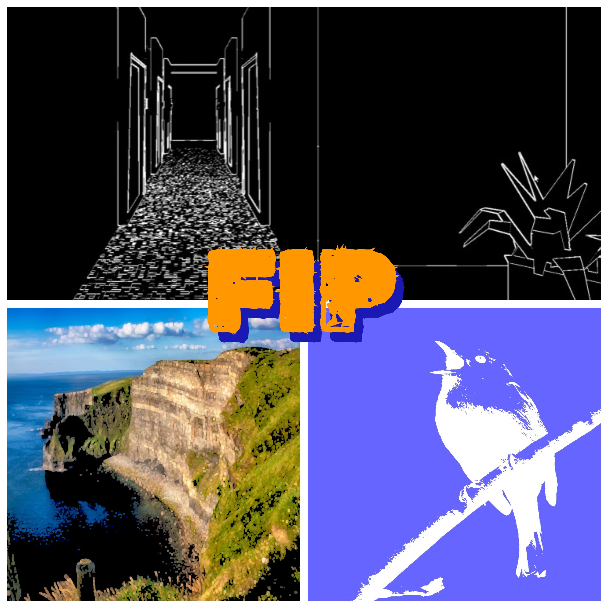

## FIP (Fast Image Processing)

> Real-time post-processing library written in GLSL for [Processing](https://processing.org/).

## What is it?
FIP is a library that allows you to add filters and effects to your Processing sketch. It runs on the GPU and therefore outperforms the built-in Processing [filters](https://processing.org/reference/filter_.html).

## Features
- 44 Effects
- Hardware Accelerated
- Documented
##
> [!WARNING]
> This library is for Processing. If you are using _p5.js_ instead, head [here](https://github.com/prontopablo/p5.FIP).

## Getting Started
FIP can be installed from Proccesing, for instructions on installation and usage, head to the reference website [here](https://prontopablo.github.io/FIP/). Alternatively, FIP can be installed as a zip file, from [releases](https://github.com/prontopablo/FIP/releases/tag/latest).

## Examples
Once FIP has been installed, example sketches can be found from within Processing. These examples demonstrate how to use FIP in different ways.

_File -> Examples -> Contributed Libraries -> FIP_

## Repository Structure
- _data:_ Shader code itself (_files ending in .glsl_). This is where the actual functionality of the library is.
- _docs:_ Reference website code that has been generated using [Material for MkDocs](https://squidfunk.github.io/mkdocs-material/) from MarkDown files.
- _mdDocs:_ Markdown files for the reference website. Much more human-readable than the files found in the _docs_ folder, should the reference website no longer be live.
- _notes:_ Personal notes taken during the development of the FIP. Only of interest if one is creating a shader library for Processing.

## Processing Library Guidelines
In accordance with the [Processing library guidelines](https://github.com/benfry/processing4/wiki/Library-Guidelines):
1. FIP has been tested on Windows 10 and Linux (Raspberry Pi OS) using Processing 4.3.
2. FIP has no dependencies.
3. Examples are included in the release.
4. [Source Code](https://github.com/prontopablo/FIP/releases)
5. Keywords: _image-processing, post-processing, filters_.
6. Last update: 25/03/24.
7. [FIP zip file](https://github.com/prontopablo/FIP/releases)

## Contributing
I welcome contributions from the community to make FIP better. If you have any suggestions, bug fixes, or new features to add, feel free to create a [pull request](https://github.com/prontopablo/FIP/pulls).

## Acknowledgments
Many of these shaders were adapted from existing solutions in other programming languages, in these cases, the links to the original shaders can be found at the top of each .glsl file.

A list of existing Processing image processing libraries can be found [here](https://prontopablo.github.io/FIP/resources).
