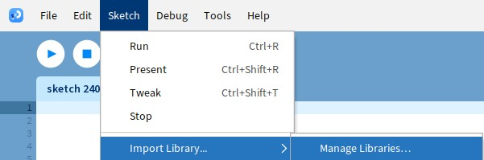

# Installation

## Option 1: Install with Library Manager
`TODO:` Upload FIP to Processing Library Manager once the library is finished.

<figcaption>The library manager can be found in Sketch > Import Library > Manage Libraries</figcaption>

## Option 2: Install Manually
[Download](TODO) and then unzip FIP. Then put the extracted folder into the "libraries" folder of Processing.