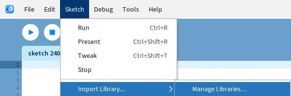
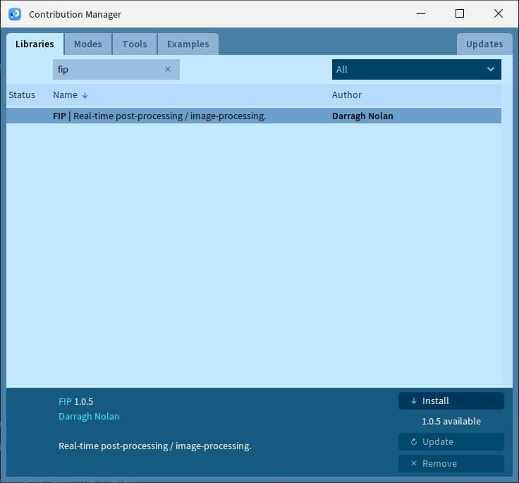
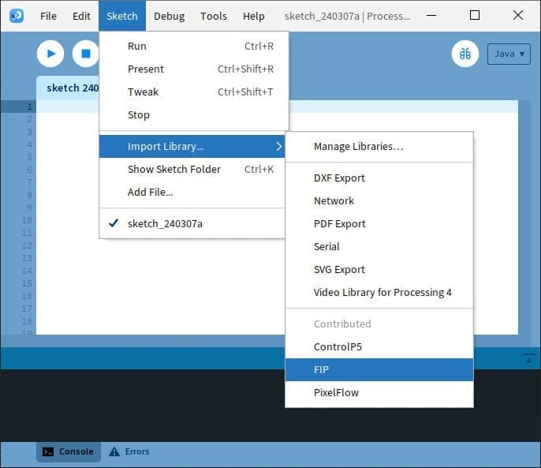

# Installation

## **Option 1:** Install with Processing Contribution Manager
FIP can be found in the Processing Contribution Manager.

    
The Processing Contribution Manager can be found in <b><i>Sketch > Import Library > Manage Libraries</i></b>.

    

        
    

    
We can then search for 'FIP' and install it.

    

        
    

    
Then to import FIP into our sketch, we can navigate to <b><i>Sketch > Import Library > FIP </i></b>.

    

        
    

## **Option 2:** Install Manually
[Download](https://github.com/prontopablo/FIP/releases/tag/latest) and then unzip FIP. Then put the extracted folder into the "libraries" folder of Processing. By default this folder can be found in `Documents\Processing\libraries`